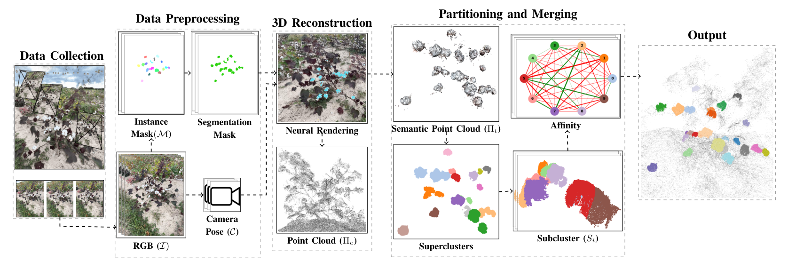

# CropNeRF



## 1. Introduction

<!-- [ALGORITHM] -->

```BibTeX
@article{muzaddid2026cropnerf,
  title={CropNeRF: A neural radiance field-based framework for crop counting},
  author={Al Muzaddid, Md Ahmed and Beksi, William J},
  journal={arXiv preprint arXiv:2601.00207},
  year={2026}
}

@data{mavmatrix/dataset.2026.02.042,
  title={{3DCotton}},
  author={Al Muzaddid, Md Ahmed and Beksi, William J},
  publisher={MavMatrix},
  version={V1},
  url={https://doi.org/10.32855/dataset.2026.02.042},
  doi={10.32855/dataset.2026.02.042},
  year={2026}
}
```

## 2. To install the environment, run the following script:
```shell
bash scripts/install.sh
```

## 3. To process the dataset, run the following script:
```shell
bash scripts/process_dataset.sh
```

## 4. To train and test the model for the 3DCotton dataset, run the following scripts:
```shell
bash scripts/train.sh
bash scripts/test.sh
```

## 5. Acknowledgement
* [robotic-vision-lab/CropNeRF-A-Neural-Radiance-Field-Based-Framework](https://github.com/robotic-vision-lab/CropNeRF-A-Neural-Radiance-Field-Based-Framework)
