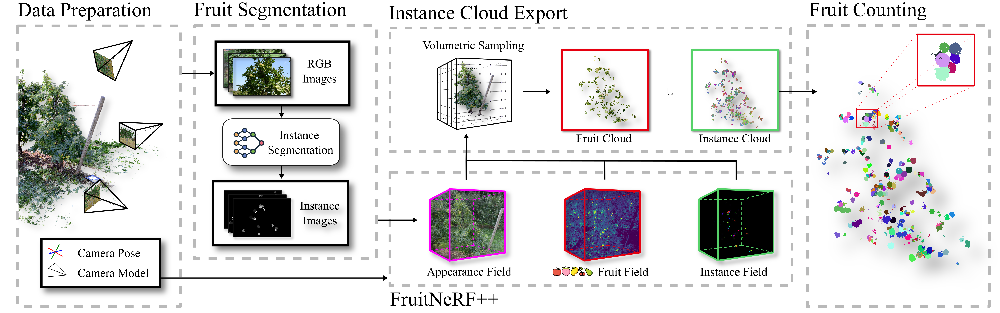

# FruitNeRF++



## 1. Introduction

<!-- [ALGORITHM] -->

```BibTeX
@inproceedings{fruitnerfpp2025,
  author    = {Meyer, Lukas and Ardelean, Andrei-Timotei and Weyrich, Tim and Stamminger, Marc},
  title     = {FruitNeRF++: A Generalized Multi-Fruit Counting Method Utilizing Contrastive Learning and Neural Radiance Fields},
  booktitle = {2025 IEEE/RSJ International Conference on Intelligent Robots and Systems (IROS)},
  year      = {2025},
  doi       = {10.1109/IROS60139.2025.11247341},
  url       = {https://meyerls.github.io/fruit_nerfpp/}
}
```

## 2. To install the environment, run the following script:
```shell
bash scripts/install.sh
```

## 3. To download pretrained weights, run the following script:
```shell
bash scripts/download_weights.sh
```

## 4. To train and test the model for the FruitNeRF dataset, run the following script:
```shell
bash scripts/train.sh
```

## 5. Acknowledgement
* [meyerls/FruitNeRFpp](https://github.com/meyerls/FruitNeRFpp)
