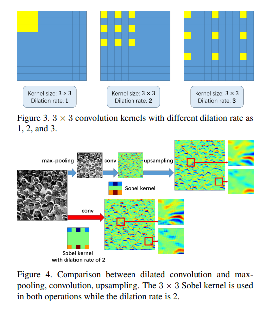

# CSRNet



## 1. Introduction

<!-- [ALGORITHM] -->

```BibTeX
@inproceedings{li2018csrnet,
  title={Csrnet: Dilated convolutional neural networks for understanding the highly congested scenes},
  author={Li, Yuhong and Zhang, Xiaofan and Chen, Deming},
  booktitle={Proceedings of the IEEE conference on computer vision and pattern recognition},
  pages={1091--1100},
  year={2018}
}
```

## 2. To process the dataset, run the following script:
```shell
bash scripts/process_dataset.sh
```

## 3. To train and test the model for the ShanghaiTech dataset, run the following scripts:
```shell
bash scripts/train_sha.sh
bash scripts/train_shb.sh
```

## 4. Acknowledgement
* [leeyeehoo/CSRNet-pytorch](https://github.com/leeyeehoo/CSRNet-pytorch)
