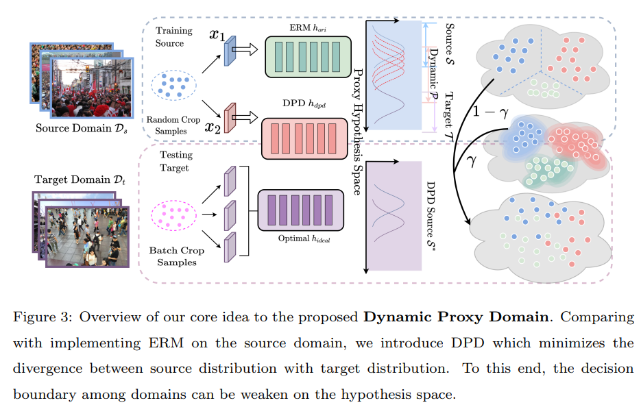

# DPD



## 1. Introduction

<!-- [ALGORITHM] -->

```BibTeX
@article{gao2024dynamic,
  title={Dynamic Proxy Domain Generalizes the Crowd Localization by Better Binary Segmentation},
  author={Gao, Junyu and Zhang, Da and Wang, Qiyu and Zhao, Zhiyuan and Li, Xuelong},
  journal={arXiv preprint arXiv:2404.13992},
  year={2024}
}
```

## 2. To download the pretrained weight, run the following script:
```shell
bash scripts/download_weight.sh
```

## 3. To train, test, and visualize the model for the ShanghaiTech dataset, run the following scripts:
```shell
bash scripts/train_sha.sh
bash scripts/test_sha.sh
bash scripts/vis_sha.sh
```

## 4. Acknowledgement
* [zhangda1018/DPD](https://github.com/zhangda1018/DPD)
