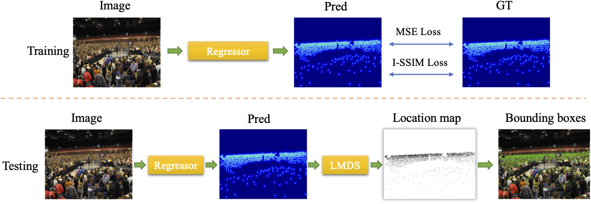

# FIDTM



## 1. Introduction

<!-- [ALGORITHM] -->

```BibTeX
@article{liang2022focal,
  title={Focal inverse distance transform maps for crowd localization},
  author={Liang, Dingkang and Xu, Wei and Zhu, Yingying and Zhou, Yu},
  journal={IEEE Transactions on Multimedia},
  year={2022},
  publisher={IEEE}
}
```

## 2. To process the dataset, run the following script:
```shell
bash scripts/process_dataset.sh
```

## 3. To download the pretrained weight, run the following script:
```shell
bash scripts/download_weight.sh
```

## 4. To train, test, and demo the model for ShanghaiTech, UCF-QNRF, JHU-Crowd++, NWPU-Crowd, and TRANCOS datasets, run the following scripts:
```shell
bash scripts/train_sha.sh
bash scripts/train_shb.sh
bash scripts/train_qnrf.sh
bash scripts/train_jhu.sh
bash scripts/train_nwpu.sh
bash scripts/train_trancos.sh
bash scripts/test_sha.sh
bash scripts/test_shb.sh
bash scripts/test_qnrf.sh
bash scripts/test_jhu.sh
bash scripts/test_nwpu.sh
bash scripts/test_trancos.sh
bash scripts/test_localization.sh
bash scripts/demo.sh
```

## 5. Acknowledgement
* [dk-liang/FIDTM](https://github.com/dk-liang/FIDTM)