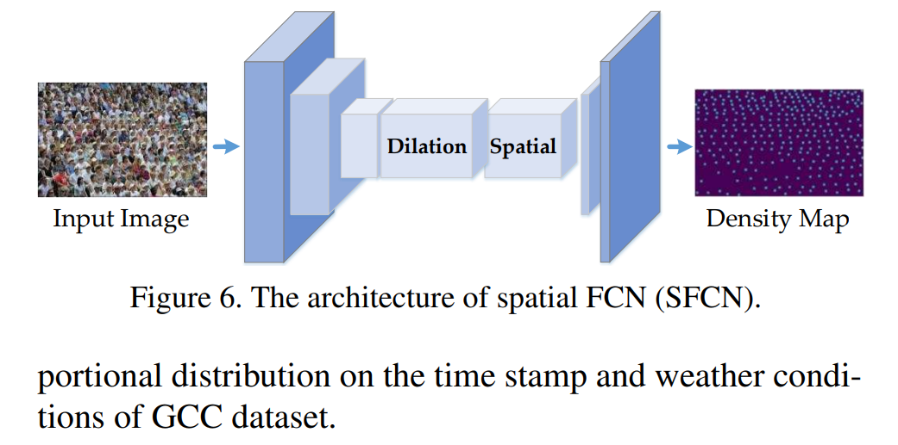

# GCC-SFCN



## 1. Introduction

<!-- [ALGORITHM] -->

```BibTeX
@inproceedings{wang2019learning,
  title={Learning from Synthetic Data for Crowd Counting in the Wild},
  author={Wang, Qi and Gao, Junyu and Lin, Wei and Yuan, Yuan},
  booktitle={Proceedings of IEEE Conference on Computer Vision and Pattern Recognition (CVPR)},
  pages={8198--8207},
  year={2019}
}
```

## 2. To download the pretrained weight, run the following script:
```shell
bash scripts/download_weight.sh
```

## 3. To train and test the model for the UCF-QNRF dataset, run the following scripts:
```shell
bash scripts/train_qnrf.sh
bash scripts/test_qnrf.sh
```

## 4. Acknowledgement
* [gjy3035/GCC-SFCN](https://github.com/gjy3035/GCC-SFCN)
