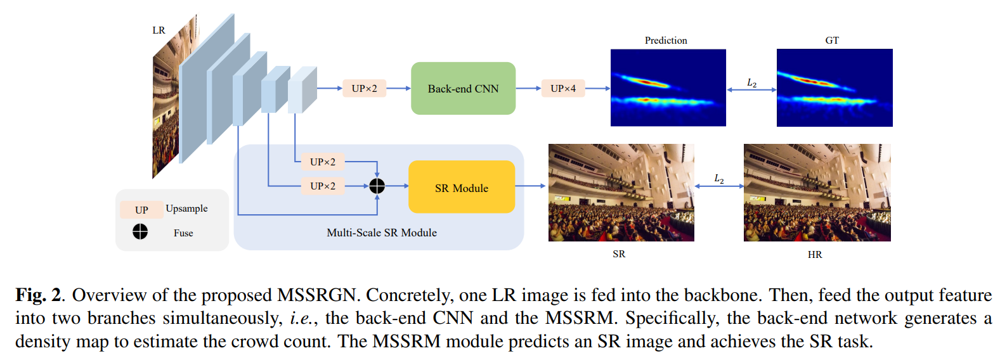

# MSSRGN



## 1. Introduction

<!-- [ALGORITHM] -->

```BibTeX
@article{xie2023super,
  title={Super-Resolution Information Enhancement For Crowd Counting},
  author={Xie, Jiahao and Xu, Wei and Liang, Dingkang and Ma, Zhanyu and Liang, Kongming and Liu, Weidong and Wang, Rui and Jin, Ling},
  journal={arXiv preprint arXiv:2303.06925},
  year={2023}
}
```

## 2. To process the dataset, run the following script:
```shell
bash scripts/process_dataset.sh
```

## 3. To test the model for the Crowd-SR dataset, run the following script:
```shell
bash scripts/test_crowdsr.sh
```

## 4. Acknowledgement
* [PRIS-CV/MSSRM](https://github.com/PRIS-CV/MSSRM)
