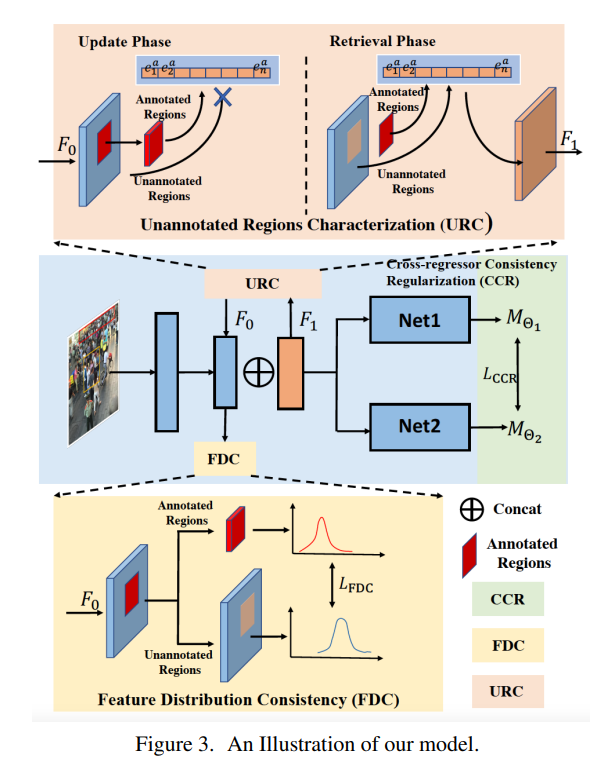

# PAL



## 1. Introduction

<!-- [ALGORITHM] -->

```BibTeX
@inproceedings{xu2021crowd,
  title={Crowd counting with partial annotations in an image},
  author={Xu, Yanyu and Zhong, Ziming and Lian, Dongze and Li, Jing and Li, Zhengxin and Xu, Xinxing and Gao, Shenghua},
  booktitle={Proceedings of the IEEE/CVF International Conference on Computer Vision},
  pages={15570--15579},
  year={2021}
}
```

## 2. To process the dataset, run the following script:
```shell
bash scripts/process_dataset.sh
```

## 3. To train and test the model for the ShanghaiTech, run the following scripts:
```shell
bash scripts/train_sha.sh
bash scripts/train_shb.sh
bash scripts/test_sha.sh
bash scripts/test_shb.sh
```

## 4. Acknowledgement
* [svip-lab/CrowdCountingPAL](https://github.com/svip-lab/CrowdCountingPAL)
