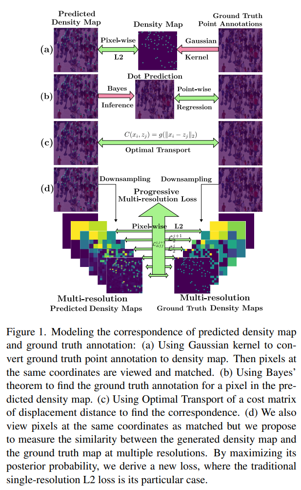

# PML



## 1. Introduction

<!-- [ALGORITHM] -->

```BibTeX
@article{yan2023progressive,
  title={Progressive multi-resolution loss for crowd counting},
  author={Yan, Ziheng and Qi, Yuankai and Li, Guorong and Liu, Xinyan and Zhang, Weigang and Yang, Ming-Hsuan and Huang, Qingming},
  journal={IEEE Transactions on Circuits and Systems for Video Technology},
  volume={34},
  number={5},
  pages={3232--3244},
  year={2023},
  publisher={IEEE}
}
```

## 2. To process the dataset, run the following script:
```shell
bash scripts/process_dataset.sh
```

## 3. To train and test the model for ShanghaiTech, UCF-QNRF, JHU-Crowd++, and NWPU-Crowd datasets, run the following scripts:
```shell
bash scripts/train_sha.sh
bash scripts/train_shb.sh
bash scripts/train_qnrf.sh
bash scripts/train_jhu.sh
bash scripts/train_nwpu.sh
```

## 4. Acknowledgement
* [streamer-AP/PML_Loss](https://github.com/streamer-AP/PML_Loss)
