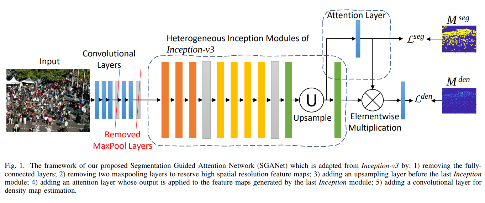

# SGANet



## 1. Introduction

<!-- [ALGORITHM] -->

```BibTeX
@article{wang2022crowd,
  title={Crowd counting via segmentation guided attention networks and curriculum loss},
  author={Wang, Qian and Breckon, Toby P},
  journal={IEEE Transactions on Intelligent Transportation Systems},
  volume={23},
  number={9},
  pages={15233--15243},
  year={2022},
  publisher={IEEE}
}
```

## 2. To train and test the model for the ShanghaiTech dataset, run the following scripts:
```shell
bash scripts/train_sha.sh
bash scripts/train_shb.sh
```

## 3. Acknowledgement
* [hellowangqian/sganet-crowd-counting](https://github.com/hellowangqian/sganet-crowd-counting)
