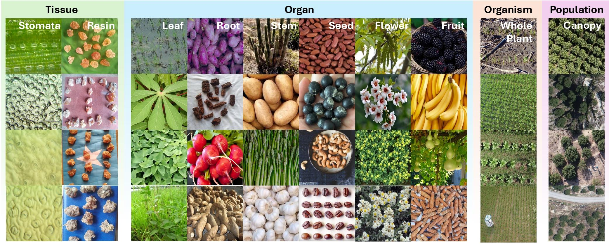

# TPC-268



## 1. Introduction

<!-- [ALGORITHM] -->

```BibTeX
@inproceedings{xu2026plant,
  title={Plant Taxonomy Meets Plant Counting: A Fine-Grained, Taxonomic Dataset for Counting Hundreds of Plant Species},
  author={Xu, Jinyu and Hu, Tianqi and Hu, Xiaonan and Zhou, Letian and Cao, Songliang and Zhang, Meng and Lu, Hao},
  booktitle={Proceedings of the IEEE/CVF Conference on Computer Vision and Pattern Recognition (CVPR)},
  year={2026}
}
```

## 2. To download the dataset, run the following script:
```shell
bash scripts/download_dataset.sh
```

## 3. To visualize the dataset, run the following script:
```shell
bash scripts/vis_tpc.sh
```

## 4. Acknowledgement
* [tiny-smart/TPC-268](https://github.com/tiny-smart/TPC-268)
