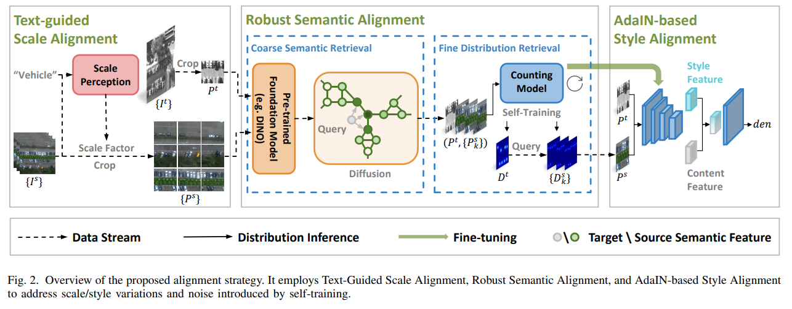

# CBD



## 1. Introduction

<!-- [ALGORITHM] -->

```BibTeX
@misc{key,
	author = {},
	title = {},
	howpublished = {\url{https://ieeexplore.ieee.org/stamp/stamp.jsp?tp=&arnumber=11206377}},
	year = {},
	note = {[Accessed 22-10-2025]},
}
```

## 2. To process the dataset, run the following script:
```shell
bash scripts/process_dataset.sh
```

## 3. To test the model for CARPK and PUCPR datasets, run the following scripts:
```shell
bash scripts/test_carpk.sh
bash scripts/test_pucpr.sh
```

## 4. Acknowledgement
* [jwang-rs/CBD-pytorch](https://github.com/jwang-rs/CBD-pytorch)
