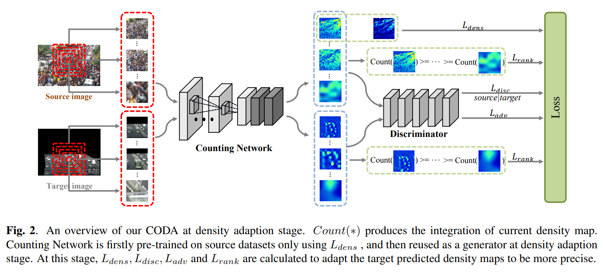

# CODA



## 1. Introduction

<!-- [ALGORITHM] -->

```BibTeX
@inproceedings{li2019coda,
  title={Coda: Counting objects via scale-aware adversarial density adaption},
  author={Li, Wang and Yongbo, Li and Xiangyang, Xue},
  booktitle={2019 IEEE International Conference on Multimedia and Expo (ICME)},
  pages={193--198},
  year={2019},
  organization={IEEE}
}
```

## 2. To process the dataset, run the following script:
```shell
bash scripts/process_dataset.sh
```

## 3. To train and test the model for the ShanghaiTech dataset, run the following script:
```shell
bash scripts/train_sha.sh
```

## 4. Acknowledgement
* [Willy0919/CODA](https://github.com/Willy0919/CODA)
