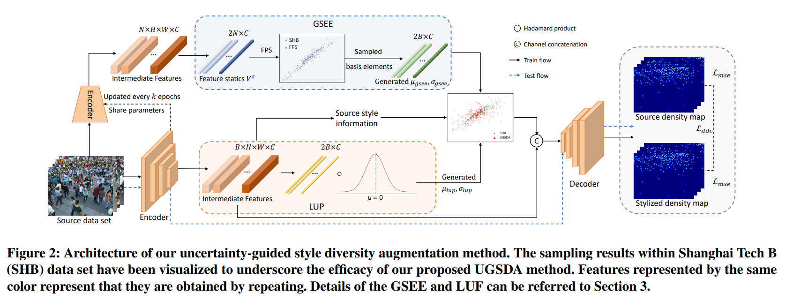

# UGSDA



## 1. Introduction

<!-- [ALGORITHM] -->

```BibTeX
@inproceedings{ding2024domain,
  title={Domain-Agnostic Crowd Counting via Uncertainty-Guided Style Diversity Augmentation},
  author={Ding, Guanchen and Liu, Lingbo and Chen, Zhenzhong and Chen, Chang Wen},
  booktitle={ACM Multimedia 2024}
}
```

## 2. To test the model for the UCF-QNRF dataset, run the following script:
```shell
bash scripts/test_qnrf.sh
```

## 3. To visualize the model for an image, run the following script:
```shell
bash scripts/vis_qnrf.sh
```

## 4. Acknowledgement
* [gcding/UGSDA-pytorch](https://github.com/gcding/UGSDA-pytorch)
