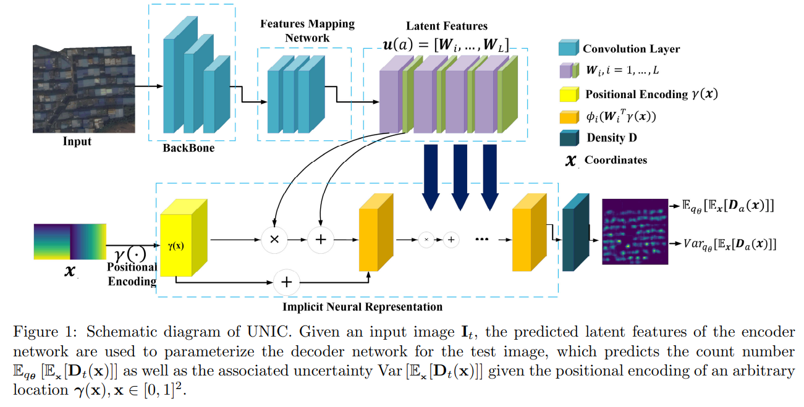

# UNIC



## 1. Introduction

<!-- [ALGORITHM] -->

```BibTeX
@inproceedings{xu2024uncertainty,
  title={Uncertainty-aware Continuous Implicit Neural Representations for Remote Sensing Object Counting},
  author={Xu, Siyuan and Wang, Yucheng and Fan, Mingzhou and Yoon, Byung-Jun and Qian, Xiaoning},
  booktitle={International Conference on Artificial Intelligence and Statistics},
  pages={4105--4113},
  year={2024},
  organization={PMLR}
}
```

## 2. To process the dataset, run the following script:
```shell
bash scripts/process_dataset.sh
```

## 3. To train and test the model for the ShanghaiTech dataset, run the following scripts:
```shell
bash scripts/train_sha.sh
bash scripts/train_shb.sh
```

## 4. Acknowledgement
* [SiyuanXu-tamu/UNIC](https://github.com/SiyuanXu-tamu/UNIC)
