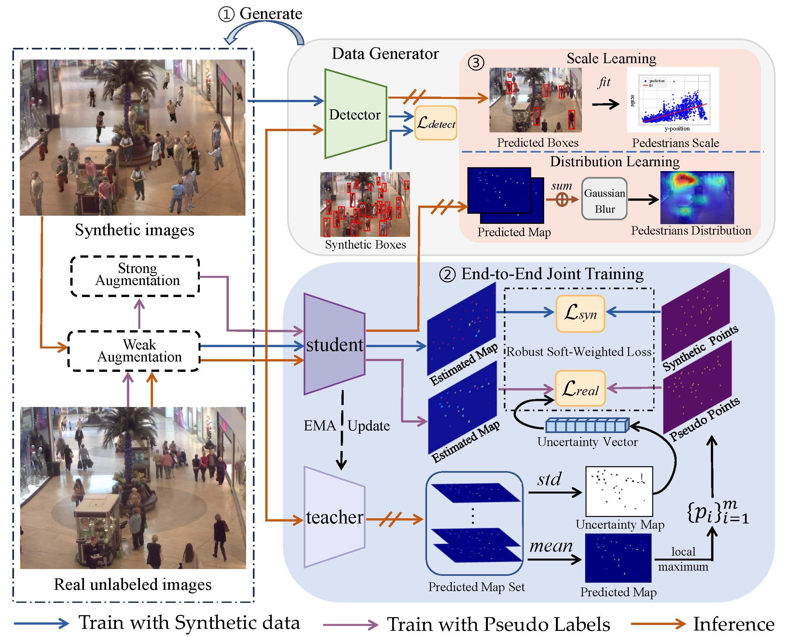

# LCSD



## 1. Introduction

<!-- [ALGORITHM] -->

```BibTeX
ARTICLE{LCSD,
  author={Fan, Yaowu and Wan, Jia and Ma, Andy J.},
  journal={IEEE Transactions on Circuits and Systems for Video Technology}, 
  title={Learning Crowd Scale and Distribution for Weakly Supervised Crowd Counting and Localization}, 
  year={2025},
  volume={35},
  number={1},
  pages={713-727}
}
```

## 2. To install the environment, run the following script:
```shell
bash scripts/install.sh
```

## 3. To train and test the model for the Mall dataset, run the following scripts:
```shell
bash scripts/train_mall.sh
bash scripts/test_mall.sh
```

## 4. Acknowledgement
* [fyw1999/LCSD](https://github.com/fyw1999/LCSD)
