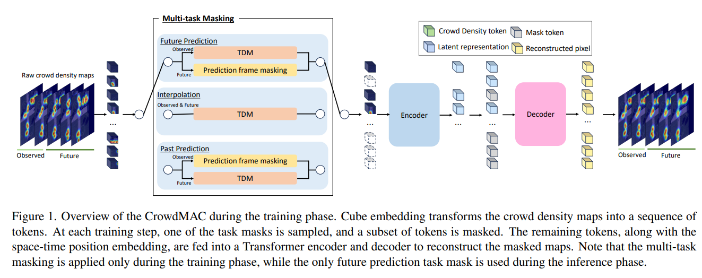

# CrowdMAC



## 1. Introduction

<!-- [ALGORITHM] -->

```BibTeX
@inproceedings{FUJII2025CrowdMAC,
    author = {Ryo Fujii, Ryo Hachiuma, and Hideo Saito},
    title = {CrowdMAC: Masked Crowd Density Completion for Robust Crowd Density Forecasting},
    booktitle = {Proceedings of the IEEE/CVF Winter Conference on Applications of Computer Vision (WACV)},
    year = {2025},
}
```

## 2. To train and test the model for SDD, IND-TIME, FDST, VSCROWD, JRDB, HT21, and ETHUCY datasets, run the following scripts:
```shell
bash scripts/train.sh
bash scripts/finetune.sh
```

## 3. Acknowledgement
* [Fujiry0/CrowdMAC](https://github.com/Fujiry0/CrowdMAC)
