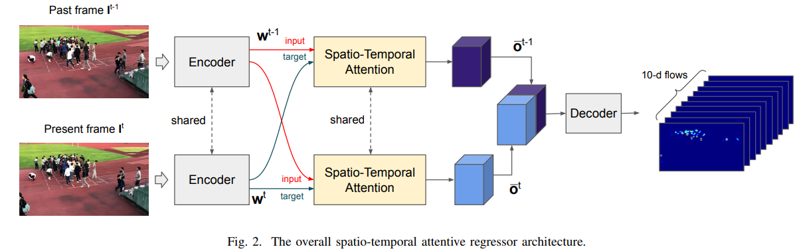

# AVCC



## 1. Introduction

<!-- [ALGORITHM] -->

```BibTeX
@inproceedings{avvenuti2022spatio,
  title={A spatio-temporal attentive network for video-based crowd counting},
  author={Avvenuti, Marco and Bongiovanni, Marco and Ciampi, Luca and Falchi, Fabrizio and Gennaro, Claudio and Messina, Nicola},
  booktitle={2022 IEEE Symposium on Computers and Communications (ISCC)},
  pages={1--6},
  year={2022},
  organization={IEEE}
}
```

## 2. To process the dataset, run the following script:
```shell
bash scripts/process_dataset.sh
```

## 3. To train and test the model for the FDST dataset, run the following scripts:
```shell
bash scripts/train_fdst.sh
bash scripts/test_fdst.sh
```

## 4. Acknowledgement
* [mesnico/attentive_video_crowd_counting](https://github.com/mesnico/attentive_video_crowd_counting)
