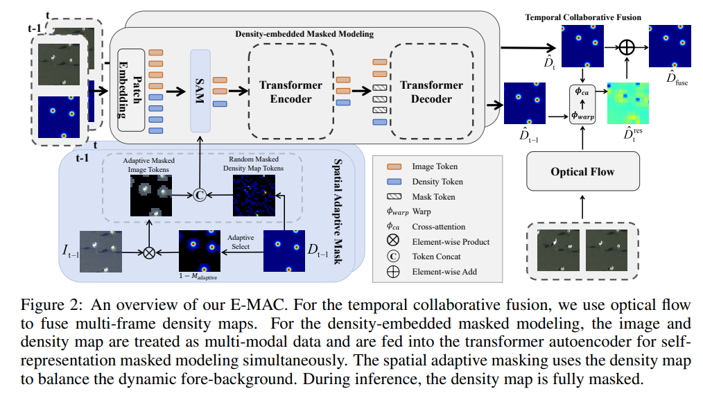

# E-MAC



## 1. Introduction

<!-- [ALGORITHM] -->

```BibTeX
@inproceedings{
cao2025efficient,
title={Efficient Masked AutoEncoder for Video Object Counting and A Large-Scale Benchmark},
author={Bing Cao and Quanhao Lu and Jiekang Feng and Qilong Wang and Pengfei Zhu and Qinghua Hu},
booktitle={The Thirteenth International Conference on Learning Representations},
year={2025},
url={https://openreview.net/forum?id=sY3anJ8C68}
}
```

## 2. To install the environment, run the following script:
```shell
bash scripts/install.sh
```

## 3. To download pretrained weights, run the following script:
```shell
bash scripts/download_weights.sh
```

## 4. To process the dataset, run the following script:
```shell
bash scripts/process_dataset.sh
```

## 5. To train and test the model for the DroneBird dataset, run the following scripts:
```shell
bash scripts/train_dronebird.sh
bash scripts/test_dronebird.sh
```

## 6. Acknowledgement
* [mast1ren/E-MAC](https://github.com/mast1ren/E-MAC)
