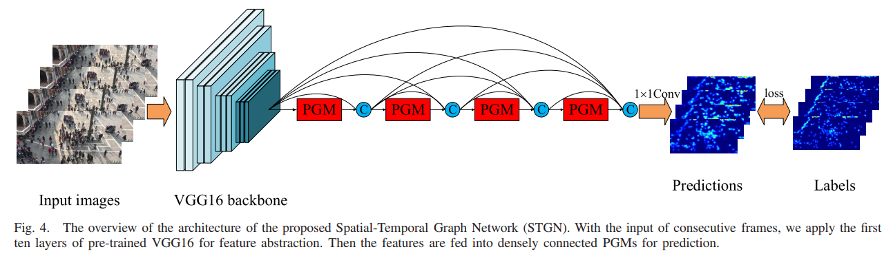

# STGN



## 1. Introduction

<!-- [ALGORITHM] -->

```BibTeX
@article{wu2022spatial,
  title={Spatial-temporal graph network for video crowd counting},
  author={Wu, Zhe and Zhang, Xinfeng and Tian, Geng and Wang, Yaowei and Huang, Qingming},
  journal={IEEE Transactions on Circuits and Systems for Video Technology},
  volume={33},
  number={1},
  pages={228--241},
  year={2022},
  publisher={IEEE}
}
```

## 2. To process the dataset, run the following script:
```shell
bash scripts/process_dataset.sh
```

## 3. To train and test the model for the FDST dataset, run the following scripts:
```shell
bash scripts/train_fdst.sh
bash scripts/test_fdst.sh
```

## 4. Acknowledgement
* [wuzhe71/STGN](https://github.com/wuzhe71/STGN)
